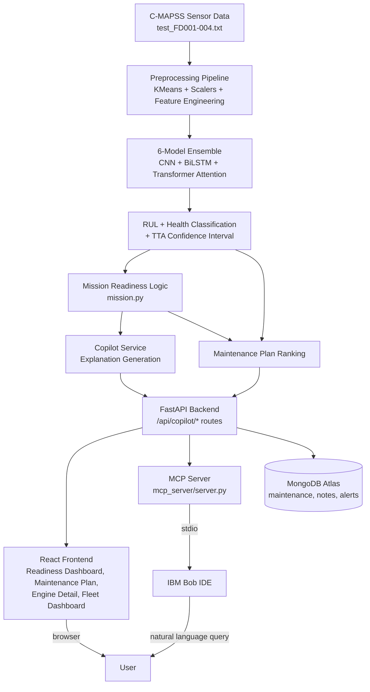

# Architecture

## System Diagram

## Component Table

| Component | Technology | Responsibility |
|---|---|---|
| Sensor data source | NASA C-MAPSS dataset | Real turbofan engine sensor time-series (21 sensors, 3 operational settings, per cycle) |
| Preprocessing | pandas, scikit-learn (KMeans, StandardScaler, MinMaxScaler) | Operational-condition clustering, normalisation, feature engineering (rolling stats, cumulative degradation) |
| ML model | TensorFlow/Keras — CNN + BiLSTM + custom Transformer-style attention pooling | RUL regression + 3-class health classification, ensemble of 6 models with test-time augmentation |
| Mission readiness logic | Python (`backend/mission.py`) | Classifies each engine as READY / AT_RISK / NOT_READY against a configurable mission window |
| Explanation generation | Python (`backend/copilot_service.py`) | Deterministic natural-language summaries from model outputs (RUL, health, top sensors, readiness) |
| Maintenance plan | Python (`backend/routes/copilot.py`) | Ranks non-ready engines by urgency, assigns recommended action tier |
| Backend API | FastAPI | Serves all fleet, engine, alert, prediction, and copilot endpoints |
| Persistence | MongoDB Atlas | Stores maintenance schedules, notes, alerts |
| Frontend | React + Vite, D3.js | Fleet Dashboard, Engine Detail, Readiness Dashboard, Maintenance Plan, Analytics, Alerts, What-If Simulator, Model Performance |
| Bob integration | IBM Bob (MCP host) + custom stdio MCP server (`mcp_server/server.py`) | Exposes four read-only tools (`get_fleet_readiness`, `get_engine_readiness`, `explain_engine`, `get_maintenance_plan`) that relay live backend data to Bob via HTTP |

## How Data Moves End-to-End

1. On backend startup, C-MAPSS test files are loaded and run through the
   full preprocessing + inference pipeline once; results are cached in
   memory and in MongoDB-backed collections.
2. A user (or Bob, via MCP) requests fleet or engine data through a REST
   endpoint.
3. For readiness-specific requests, `mission.py`'s `get_readiness()` is
   called with the engine's existing RUL and confidence values — it does not
   re-run the ML model, only reasons over its already-computed output.
4. For maintenance-plan requests, non-ready engines are filtered and sorted
   by urgency score, computed from the same readiness data.
5. For explanation requests, `copilot_service.py` composes a natural-language
   string from the engine's RUL, health probabilities, top degrading sensors,
   and readiness status.
6. The MCP server (`mcp_server/server.py`) is a thin HTTP relay: when Bob
   calls one of its four tools, the MCP server makes a `GET` request to the
   already-running FastAPI backend and returns the JSON/text response
   directly — no logic is duplicated between the two layers.

## Security & Scalability Notes

- The MCP server is entirely read-only — it cannot write to the database or
  trigger any state-changing action, which limits blast radius if Bob's
  queries were ever misused.
- The MCP server assumes the FastAPI backend is already running on
  `localhost` (configurable via the `BACKEND_URL` environment variable) —
  it is a companion process, not a replacement for the backend.
- The ML inference pipeline is cached at startup rather than re-run per
  request, which keeps API response times low but means new sensor data
  requires either a cache rebuild or use of the existing upload/predict
  endpoint for new files.
- No credentials or API keys are required for the MCP layer itself, since it
  performs no external LLM calls — this also means there are no external
  network dependencies or costs associated with running the copilot layer.